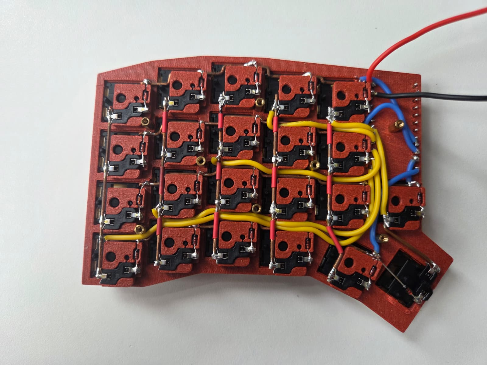

# patkb

This repo is the result of my first custom keyboard build.
The keyboard is a split keyboard inspired by the [SofleKeyboard](https://github.com/josefadamcik/SofleKeyboard) without the top row.
At the time of the build I did not feel comfortable with the idea of designing and ordering a pcb for this keyboard.
I opted for handwiring the keyboard, but I wanted to keep the option of hotswapping the Kailh Choc V2 Low Profile Switches.
I ended up 3D-printing a holder plate for the hotswap sockets which I handwired to the [nice!nano v2](https://nicekeyboards.com/nice-nano/).
The keyboard is programmed with the ZMK firmware including a custom shield for the new layout.

This repo is holding the 3D-files, a list of components and a ZMK shield for the layout.

## The hardware

As mentioned I designed a custom holder plate for the hotswap sockets.
It is designed to glue in the sockets and then solder them together in the matrix layout.
The soldering requires a bit of patience as each socket need a diode soldered first and then a wire for each row and column.

Top plate: [Top plate, left half](3d-files/TopPlat_Left.stl)

Case: [Case, left half](3d-files/Case_Left.stl)

### Bill of materials

The matrix has 44 keys total (22 per half — see the [Wiring](#wiring) section
for the exact per-key layout), which drives the quantities below.

| Part | Qty | Notes |
|---|---:|---|
| [nice!nano v2](https://nicekeyboards.com/nice-nano/) | 2 | One per half; the left half is flashed as the split central (`patkb_left`), right as peripheral (`patkb_right`) |
| Kailh Choc V2 low-profile switches | 44 | 22 per half; any force/tactility variant works — [Kailh Choc V2 product page](https://www.kailh.net/products/kailh-choc-v2-low-profile-switch-set) |
| Kailh Choc hotswap sockets | 44 | 22 per half; the standard "Kailh Choc" PCB/hotswap footprint — Choc V2 switch pins are backward-compatible with it |
| Small-signal switching diodes (e.g. 1N4148) | 44 | 22 per half, one per switch, through-hole (DO-35), matches `diode-direction = "col2row"` in the shield |
| Low-profile keycaps for Kailh Choc | 44 | 22 per half |
| 3.7V LiPo battery, JST-PH 2.0 connector | 2 | One per half — nice!nano v2 has a built-in charge circuit |
| SPDT slide switch (power on/off) | 1–2 | Optional, one per battery; matches the small switch visible next to the reset button in the wiring photos |
| Hookup wire, ~28-30 AWG, 2+ colors | a few meters | Solid-core is easiest to route/hold shape for the row/column matrix bus wires and diode-to-diode jumps, to route the rows and columns to the nice!nano a flexible wire is needed (as in the [wiring photos](#wiring)) |
| Heat-shrink tubing or electrical tape | — | Insulate diode legs / wire crossings inside the case |
| M2 screws and spacer | as needed (recommend 8 per side to prevent bending of the plate) | To close the case halves |

### Wiring

patkb is hand-wired (no PCB): each half is a `col2row` diode matrix soldered
onto the 3D-printed hotswap-socket plate and wired to a nice!nano v2.

**Diode direction — `col2row`:** every switch has one diode in series, wired
so current flows from the column wire, through the diode, into the row wire.
The topplate has a slot to fit the diodes in to hold them in place.

**Physical key → matrix position**: the positions are very intuitive. A column is formed by all switches directly below/above each other. A row is made up by all switches directly next to each other. Note: row 3 and 4 have one column more.

**GPIO pin assignments** (from `patkb_left.overlay` / `patkb_right.overlay`;
pin numbers are ZMK's [pro_micro pinout](https://zmk.dev/docs/development/hardware-integration/pro-micro-shield-connector)
positions — check that reference against the nice!nano's silkscreen for the
physical pad):

| Half | Row 0 | Row 1 | Row 2 | Row 3 |
|---|---|---|---|---|
| Left (`patkb_left`) | 15 | 14 | 16 | 10 |
| Right (`patkb_right`) | 6 | 7 | 8 | 9 |

| Half | Col 0/6 | Col 1/7 | Col 2/8 | Col 3/9 | Col 4/10 | Col 5/11 |
|---|---|---|---|---|---|---|
| Left (`patkb_left`), global col | 0 → 4 | 1 → 5 | 2 → 6 | 3 → 7 | 4 → 8 | 5 → 9 |
| Right (`patkb_right`), global col | 6 → 19 | 7 → 18 | 8 → 15 | 9 → 14 | 10 → 16 | 11 → 10 |

(Read the right-half row as "global column → pro_micro pin".)

If you ever rewire or change the matrix, update `patkb_left.overlay` /
`patkb_right.overlay` and `patkb.dtsi` (row/col count, matrix transform)
first — the tables above are a snapshot of what's in those files, not the
source of truth.

## The software

The repo contains a [ZMK](https://zmk.dev) module for **patkb**.
This is a shield based on the layout and wiring, desribing which gpio pins are used and how the switches are positioned.
I also includes the keymap definition (`boards/shields/patkb/patkb.keymap`).
(`config/west.yml`) and (`.github/workflows/build.yml`) are used to automatically build the files to flash the nice!nano with.
ZMK or Zephyr itself are not included in this repo, those are pulled in at build time.

### Keymap

The keymap (`boards/shields/patkb/patkb.keymap`) uses a German (`locale/keys_de.h`)
layout and defines 4 layers:

- **default** — base QWERTY layer, home-row mods/layer-taps on `A S D F` /
  `H J K L Ö` (hold for layer or shift, tap for the letter).
- **first** (`&lt FIRST ...`) — symbols and punctuation (`@ " € ~ '`, brackets,
  math operators, etc).
- **second** (`&lt SECOND ...` / thumb key) — navigation (arrows, page up/down),
  media/volume, screenshot, clipboard (cut/copy/paste).
- **num** — numpad-style digit layer.

Two custom hold-tap behaviors are defined:

- `lt` (layer-tap): hold for a layer, tap for a key.
- `mt` (mod-tap): hold for a modifier, tap for a key.

Both use `flavor = "balanced"` with a 280 ms tapping term and a 150 ms
require-prior-idle, tuned to avoid misfires while typing fast.

### Layout

This diagram is generated automatically from `boards/shields/patkb/patkb.keymap`
using [`keymap-drawer`](https://github.com/caksoylar/keymap-drawer): every push
that touches the keymap, the shield's devicetree, or `keymap_drawer.config.yaml`
triggers `.github/workflows/draw-keymaps.yml`, which re-renders
`keymap-drawer/patkb.svg` and commits it back — so it never drifts out of sync
with the actual keymap.

patkb isn't a keyboard `keymap-drawer` knows about, so the physical layout is
passed explicitly as a `draw_args` CLI flag in the workflow
(`-n "444442vv 2vv44444"`, ["cols+thumbs" notation](https://github.com/caksoylar/keymap-drawer)):
5 four-key columns per half, plus one 2-key column bottom-aligned to rows 2-3
(the `MUTE`/`PLAY` and `CTRL`/`BSPC` keys) — matching the matrix transform in
`patkb.dtsi`. If the physical key layout ever changes, update that notation
string in `.github/workflows/draw-keymaps.yml` to match.

German (`DE_*`) key codes and the custom `lt`/`mt` hold-tap behaviors are
resolved into readable legends via `keymap_drawer.config.yaml`.

### Building firmware

Push this repo to GitHub. `.github/workflows/build.yml` uses ZMK's reusable
`build-user-config.yml` workflow, driven by `build.yaml`, to build on every
push/PR. It produces three firmware artifacts:

- `patkb_left` (with ZMK Studio support)
- `patkb_right`
- `settings_reset` (utility firmware to clear paired-bond/settings storage)

Download the `.uf2` files from the Actions run's artifacts once it finishes.

### Flashing

Put each half's controller into bootloader mode (double-tap reset on the
nice!nano) and copy the matching `.uf2` file (`patkb_left` /
`patkb_right`) onto the drive that appears. See ZMK's
[flashing docs](https://zmk.dev/docs/development/local-toolchain/build-flash#flashing)
for details.

### Changing the keymap

1. Edit `boards/shields/patkb/patkb.keymap`.
2. Push — CI rebuilds and produces new `.uf2` artifacts, and the layout diagram in the [Layout](#layout) section is
   automatically re-rendered.
3. Reflash both halves.

Alternatively, since ZMK Studio is enabled on `patkb_left`, simple binding
changes can be made live from the [ZMK Studio](https://zmk.studio) app while
connected via USB, without rebuilding/reflashing.
