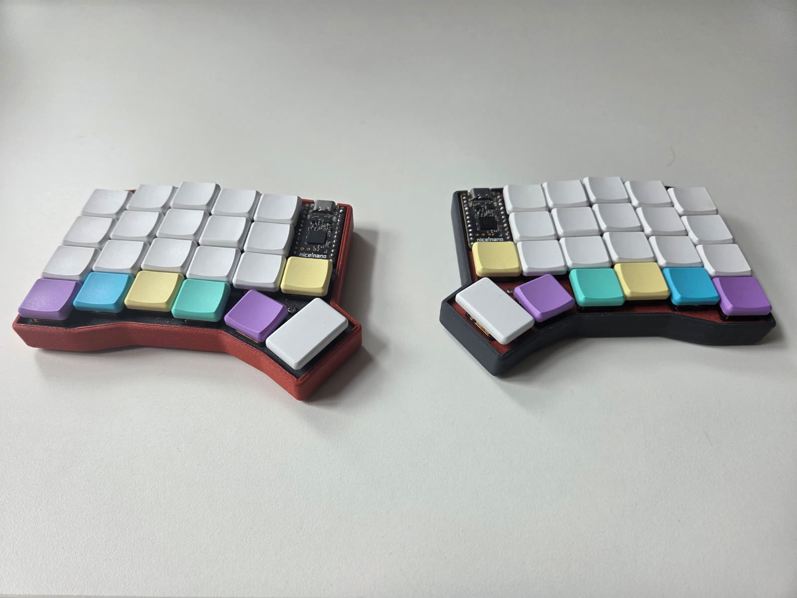
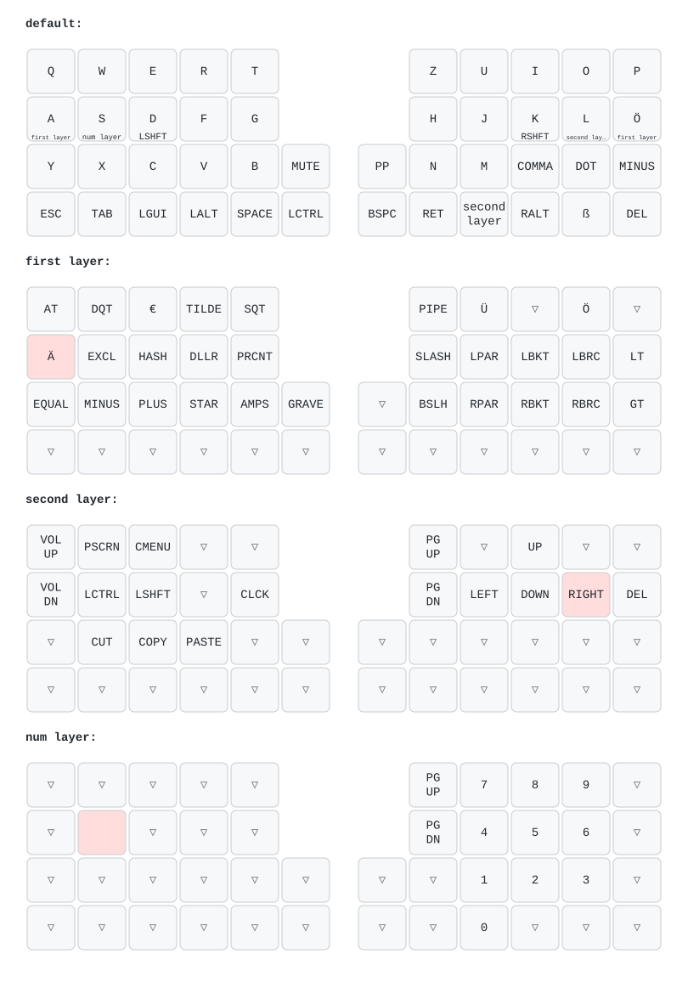

# patkb

This repo is the result of my first custom keyboard build.
The keyboard is a split keyboard inspired by the [SofleKeyboard](https://github.com/josefadamcik/SofleKeyboard) without the top row.
At the time of the build I did not feel comfortable with the idea of designing and ordering a pcb for this keyboard.
I opted for handwiring the keyboard, but I wanted to keep the option of hotswapping the Kailh Choc V2 Low Profile Switches.
I ended up 3D-printing a holder plate for the hotswap sockets which I handwired to the [nice!nano v2](https://nicekeyboards.com/nice-nano/).
The keyboard is programmed with the ZMK firmware and a custom shield.

This repo is holding the 3D-files, a list of components and the shield



## What it is

A [ZMK](https://zmk.dev) module for **patkb**, a custom split mechanical keyboard.

This repo contains only the shield definition (hardware description, keymap,
Kconfig) and the [`west`](https://docs.zephyrproject.org/latest/develop/west/index.html)
manifest needed to build firmware for it — it does not vendor ZMK or Zephyr
itself, those are pulled in at build time.

## Hardware

- Split keyboard, 4 rows x 12 columns (6 columns per half), wired as a
  `col2row` GPIO matrix.
- Controller: [Pro Micro](https://zmk.dev/docs/development/hardware-integration/pro-micro-shield-connector)
  footprint, target board `nice_nano_v2`.
- Two shield targets: `patkb_left` and `patkb_right`. The left half is
  configured as the split central (`ZMK_SPLIT_ROLE_CENTRAL`).
- [ZMK Studio](https://zmk.studio) is enabled on the left half via the
  `studio-rpc-usb-uart` snippet, so the keymap's tap/hold layers can be
  tweaked live without reflashing.

See `boards/shields/patkb/`:

| File | Purpose |
|---|---|
| `patkb.dtsi` | Shared devicetree: matrix transform (4x12) and kscan node |
| `patkb_left.overlay` / `patkb_right.overlay` | Per-half GPIO pin mapping for rows/columns |
| `patkb.keymap` | The keymap: layers, behaviors, key bindings |
| `Kconfig.shield` / `Kconfig.defconfig` | Shield Kconfig wiring (board name, split role) |
| `patkb.zmk.yml` | Shield metadata used by ZMK's shield/module discovery |

## Keymap

The keymap (`boards/shields/patkb/patkb.keymap`) uses a German (`locale/keys_de.h`)
layout and defines 4 layers:

- **default** — base QWERTY layer, home-row mods/layer-taps on `A S D F` /
  `H J K L Ö` (hold for layer or shift, tap for the letter).
- **first** (`&lt FIRST ...`) — symbols and punctuation (`@ " € ~ '`, brackets,
  math operators, etc).
- **second** (`&lt SECOND ...` / thumb key) — navigation (arrows, page up/down),
  media/volume, screenshot, clipboard (cut/copy/paste).
- **num** — numpad-style digit layer.

Two custom hold-tap behaviors are defined:

- `lt` (layer-tap): hold for a layer, tap for a key.
- `mt` (mod-tap): hold for a modifier, tap for a key.

Both use `flavor = "balanced"` with a 280 ms tapping term and a 150 ms
require-prior-idle, tuned to avoid misfires while typing fast.

## Layout



This diagram is generated automatically from `boards/shields/patkb/patkb.keymap`
using [`keymap-drawer`](https://github.com/caksoylar/keymap-drawer): every push
that touches the keymap, the shield's devicetree, or `keymap_drawer.config.yaml`
triggers `.github/workflows/draw-keymaps.yml`, which re-renders
`keymap-drawer/patkb.svg` and commits it back — so it never drifts out of sync
with the actual keymap.

patkb isn't a keyboard `keymap-drawer` knows about, so the physical layout is
passed explicitly as a `draw_args` CLI flag in the workflow
(`-n "444442vv 2vv44444"`, ["cols+thumbs" notation](https://github.com/caksoylar/keymap-drawer)):
5 four-key columns per half, plus one 2-key column bottom-aligned to rows 2-3
(the `MUTE`/`PLAY` and `CTRL`/`BSPC` keys) — matching the matrix transform in
`patkb.dtsi`. If the physical key layout ever changes, update that notation
string in `.github/workflows/draw-keymaps.yml` to match.

German (`DE_*`) key codes and the custom `lt`/`mt` hold-tap behaviors are
resolved into readable legends via `keymap_drawer.config.yaml`.

## Building firmware

### Via GitHub Actions (recommended)

Push this repo to GitHub. `.github/workflows/build.yml` uses ZMK's reusable
`build-user-config.yml` workflow, driven by `build.yaml`, to build on every
push/PR. It produces three firmware artifacts:

- `patkb_left` (with ZMK Studio support)
- `patkb_right`
- `settings_reset` (utility firmware to clear paired-bond/settings storage)

Download the `.uf2` files from the Actions run's artifacts once it finishes.

### Locally (via Docker)

Following ZMK's [local toolchain via Docker](https://zmk.dev/docs/development/local-toolchain/build-with-docker) instructions, from this repo's root:

```sh
docker run --rm -it -v "$PWD":/workspaces/patkb -w /workspaces/patkb \
  zmkfirmware/zmk-dev-arm:stable \
  west init -l config && west update && west zephyr-export

docker run --rm -it -v "$PWD":/workspaces/patkb -w /workspaces/patkb \
  zmkfirmware/zmk-dev-arm:stable \
  west build -s zmk/app -b nice_nano_v2 -- \
    -DSHIELD=patkb_left -DZMK_CONFIG=/workspaces/patkb/config \
    -DSNIPPET=studio-rpc-usb-uart

# repeat with -DSHIELD=patkb_right (no snippet) for the right half
```

The resulting UF2 is at `build/zephyr/zmk.uf2`.

## Flashing

Put each half's controller into bootloader mode (double-tap reset on the
nice!nano) and copy the matching `.uf2` file (`patkb_left` /
`patkb_right`) onto the drive that appears. See ZMK's
[flashing docs](https://zmk.dev/docs/development/local-toolchain/build-flash#flashing)
for details.

## Changing the keymap

1. Edit `boards/shields/patkb/patkb.keymap`.
2. Push — CI rebuilds and produces new `.uf2` artifacts (or build locally as
   above), and the layout diagram in the [Layout](#layout) section is
   automatically re-rendered.
3. Reflash both halves.

Alternatively, since ZMK Studio is enabled on `patkb_left`, simple binding
changes can be made live from the [ZMK Studio](https://zmk.studio) app while
connected via USB, without rebuilding/reflashing.

## Repo layout

```
boards/shields/patkb/       shield definition (devicetree, keymap, Kconfig)
config/west.yml              west manifest (pins ZMK + Zephyr module versions)
zephyr/module.yml            marks this repo as a west/Zephyr module (board_root)
build.yaml                   GitHub Actions build matrix (board + shield combos)
keymap_drawer.config.yaml    keymap-drawer legend/parsing config (German keys, etc)
keymap-drawer/               auto-generated layout diagram (patkb.svg) + parsed YAML
.github/workflows/           CI: builds firmware and redraws the layout on every push
```

## Provenance

This shield was originally developed alongside another custom keyboard in a
combined config repo and was split out here so patkb has its own
self-contained module and build pipeline.

## License

MIT, see [LICENSE](LICENSE) — the same license as [ZMK](https://github.com/zmkfirmware/zmk) itself.
